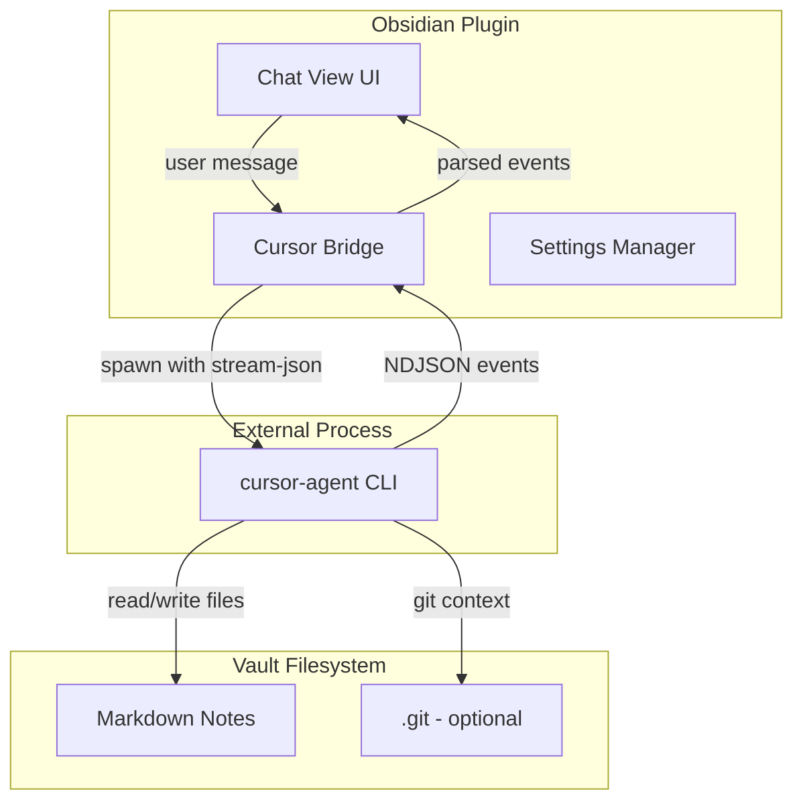
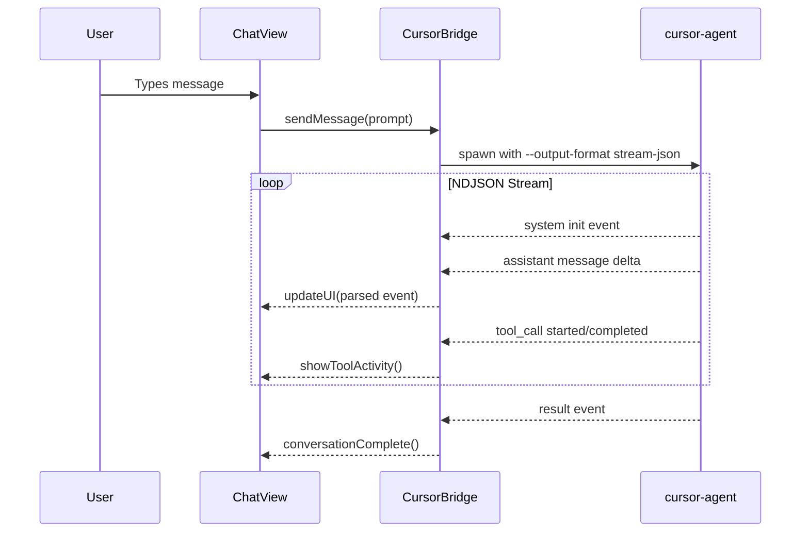

# Cursor Agent Chat Plugin Implementation Plan

## Architecture Overview



## Data Flow



## File Structure

```javascript
src/
  main.ts              # Plugin lifecycle only
  settings.ts          # Settings interface + tab
  types.ts             # TypeScript interfaces for NDJSON events
  cursor/
    bridge.ts          # Spawns cursor-agent, parses NDJSON stream
    session.ts         # Session management (resume, list)
    auth.ts            # Authentication helper (detect login vs API key)
  ui/
    chat-view.ts       # ItemView for sidebar chat panel
    chat-header.ts     # Model picker dropdown + action buttons
    message-renderer.ts # Renders messages, tool calls, markdown
    input-area.ts      # Chat input with send button
  utils/
    path-utils.ts      # Vault/system path conversion
```

## Key Implementation Details

### 1. Cursor Bridge ([src/cursor/bridge.ts](src/cursor/bridge.ts))

Uses Node.js `child_process.spawn` to run:

```bash
cursor-agent -p "user prompt" --output-format stream-json --cwd <vault-path>
```

Parses NDJSON stream line-by-line and emits typed events:

- `system` (init) - session_id, model info
- `assistant` - text content for rendering
- `tool_call` (started/completed) - file reads/writes, show activity
- `result` - final completion

### 2. Chat View ([src/ui/chat-view.ts](src/ui/chat-view.ts))

Registers as `ItemView` in right sidebar:

- Message history display with markdown rendering
- Streaming text updates as NDJSON arrives
- Tool call indicators (reading file X, writing file Y)
- Input area with send button + keyboard shortcut

### 3. Settings Design

**Settings Tab** ([src/settings.ts](src/settings.ts)):

| Setting | Type | Default | Description |

|---------|------|---------|-------------|

| `apiKey` | string (secret) | "" | Manual API key (only used if not logged in via CLI) |

| `showToolCalls` | toggle | true | Show file read/write activity in chat |

| `permissionMode` | dropdown | "default" | "default" (confirm) or "yolo" (auto-approve) |

| `customInstructions` | textarea | "" | Custom system prompt added to all conversations |

| `workingDirectory` | string | "" | Override cwd (empty = vault root) |

**Chat UI Header** (in [src/ui/chat-view.ts](src/ui/chat-view.ts)):

| Element | Description |

|---------|-------------|

| Model dropdown | Quick model switching (Claude 4 Sonnet, GPT-5, etc.) |

| New chat button | Start fresh conversation |

| Resume button | Resume last conversation |

**Authentication Flow**:

1. Check if `cursor-agent` is logged in (via existing credentials)
2. If not, use `apiKey` from settings with `--api-key` flag
3. Show warning notice if neither available

### 4. Session Management ([src/cursor/session.ts](src/cursor/session.ts))

- Store `session_id` from init events
- Commands: "Resume last conversation", "List conversations"
- Uses `cursor-agent resume` and `cursor-agent ls`

## Git Integration (Recommended, Not Required)

**Why Git helps:**

- Cursor agent uses Git for semantic search and context
- Agent can understand project structure, recent changes
- Better responses when modifying interconnected notes

**Without Git:**

- Plugin still works - agent can read/write files
- Less context-aware but functional

**With obsidian-git:**

- Optional auto-commit after agent changes
- Detect if vault is Git repo via `git rev-parse --git-dir`

## Desktop-Only Constraint

[manifest.json](manifest.json) must set `"isDesktopOnly": true` because:

- `child_process.spawn` requires Node.js/Electron
- Mobile Obsidian cannot run CLI processes

## Dependencies

- No new npm dependencies needed (uses Node.js built-ins via Electron)
- External: `cursor-agent` CLI must be installed (`curl https://cursor.com/install -fsS | bash`)

## Commands to Register

| Command ID | Name | Action ||------------|------|--------|| `open-chat` | Open Cursor chat | Opens chat view in sidebar || `send-selection` | Send selection to Cursor | Sends selected text as prompt || `resume-conversation` | Resume last conversation | `cursor-agent resume` || `new-conversation` | New conversation | Clears session, starts fresh |

## Risk Considerations

1. **CLI availability**: Settings should validate cursor-agent is installed
2. **Long-running processes**: Implement cancellation and timeout handling