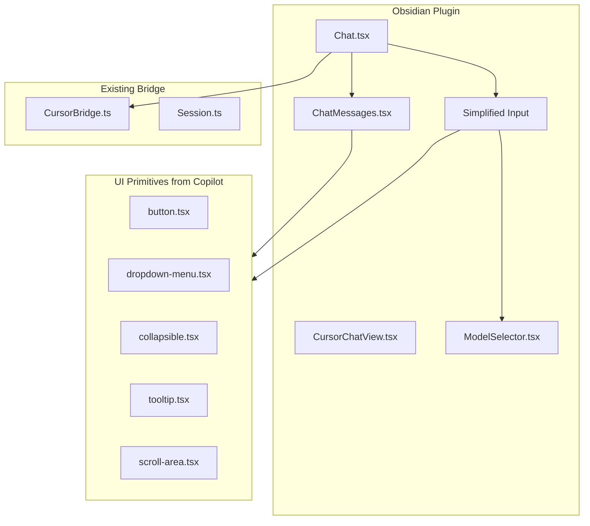

---

name: React UI Migration

overview: Migrate the cursor-agent plugin from vanilla TypeScript to React using Tailwind CSS, copying reusable components from obsidian-copilot and adapting them to work with the cursor-agent CLI bridge.

todos:

    - id: setup-deps

content: Add React, Tailwind, Radix UI dependencies to package.json

status: completed

    - id: setup-build

content: Update tsconfig.json and esbuild.config.mjs for JSX + Tailwind

status: completed

    - id: copy-ui-primitives

content: Copy UI components (button, dropdown, tooltip, etc.) from obsidian-copilot

status: completed

    - id: copy-chat-components

content: Copy Chat, ChatMessages, ChatSingleMessage, ChatHistoryPopover

status: completed

    - id: adapt-view

content: Adapt CopilotView to CursorChatView using existing CursorBridge

status: completed

    - id: adapt-chat

content: Simplify Chat.tsx to work with CursorBridge instead of LangChain

status: completed

- id: adapt-model-selector

content: Adapt ModelSelector for cursor-agent models

status: completed

- id: simplify-input

content: Replace Lexical with simple textarea + basic @mention

status: completed

    - id: wire-streaming

content: Wire NDJSON events to React state for streaming UI

status: pending

    - id: test-integration

content: Test full chat flow with cursor-agent CLI

status: pending

---

# React UI Migration Plan

## Architecture




## Phase 1: Setup Dependencies and Build Infrastructure

Add to [package.json](package.json):

-   `react`, `react-dom` + types
-   `tailwindcss`, `tailwindcss-animate`, `tailwind-merge`, `clsx`, `class-variance-authority`
-   Radix UI: `@radix-ui/react-dropdown-menu`, `@radix-ui/react-tooltip`, `@radix-ui/react-collapsible`, `@radix-ui/react-scroll-area`, `@radix-ui/react-slot`
-   `lucide-react` for icons

Update [tsconfig.json](tsconfig.json): Add `"jsx": "react"` and path aliases.Create `tailwind.config.js` based on Copilot's config (Obsidian CSS variable integration).

## Phase 2: Copy UI Primitives (Terminal Commands)

```bash
# Create directory structure
mkdir -p src/components/ui src/lib

# Copy UI primitives
cp ~/coding/misc/obsidian-copilot/src/components/ui/button.tsx src/components/ui/
cp ~/coding/misc/obsidian-copilot/src/components/ui/dropdown-menu.tsx src/components/ui/
cp ~/coding/misc/obsidian-copilot/src/components/ui/tooltip.tsx src/components/ui/
cp ~/coding/misc/obsidian-copilot/src/components/ui/collapsible.tsx src/components/ui/
cp ~/coding/misc/obsidian-copilot/src/components/ui/scroll-area.tsx src/components/ui/
cp ~/coding/misc/obsidian-copilot/src/components/ui/badge.tsx src/components/ui/
cp ~/coding/misc/obsidian-copilot/src/components/ui/textarea.tsx src/components/ui/

# Copy lib utils
cp ~/coding/misc/obsidian-copilot/src/lib/utils.ts src/lib/

# Copy tailwind config and plugin
cp ~/coding/misc/obsidian-copilot/tailwind.config.js ./
cp ~/coding/misc/obsidian-copilot/src/lib/plugins/colorOpacityPlugin.ts src/lib/plugins/

# Copy base tailwind CSS
mkdir -p src/styles
cp ~/coding/misc/obsidian-copilot/src/styles/tailwind.css src/styles/
```


## Phase 3: Copy Chat Components (Terminal Commands)

```bash
# Copy chat components
mkdir -p src/components/chat-components

cp ~/coding/misc/obsidian-copilot/src/components/CopilotView.tsx src/components/CursorChatView.tsx
cp ~/coding/misc/obsidian-copilot/src/components/Chat.tsx src/components/
cp ~/coding/misc/obsidian-copilot/src/components/chat-components/ChatMessages.tsx src/components/chat-components/
cp ~/coding/misc/obsidian-copilot/src/components/chat-components/ChatSingleMessage.tsx src/components/chat-components/
cp ~/coding/misc/obsidian-copilot/src/components/chat-components/ChatButtons.tsx src/components/chat-components/
cp ~/coding/misc/obsidian-copilot/src/components/chat-components/ChatControls.tsx src/components/chat-components/
cp ~/coding/misc/obsidian-copilot/src/components/chat-components/ChatHistoryPopover.tsx src/components/chat-components/
cp ~/coding/misc/obsidian-copilot/src/components/chat-components/ToolCallBanner.tsx src/components/chat-components/

# Copy ModelSelector
cp ~/coding/misc/obsidian-copilot/src/components/ui/ModelSelector.tsx src/components/ui/
cp ~/coding/misc/obsidian-copilot/src/components/ui/model-display.tsx src/components/ui/

# Copy context file
cp ~/coding/misc/obsidian-copilot/src/context.ts src/

# Copy hooks
mkdir -p src/hooks
cp ~/coding/misc/obsidian-copilot/src/hooks/useChatScrolling.ts src/hooks/
```


## Phase 4: Adapt Components to Cursor-Agent

Key adaptations needed after copying:

1. **CursorChatView.tsx**: Replace `ChainManager` with `CursorBridge`, remove Copilot-specific context
2. **Chat.tsx**: Strip LangChain/Copilot Plus logic, wire to `CursorBridge.sendMessage()`
3. **ModelSelector.tsx**: Use cursor-agent models from [src/cursor/models.ts](src/cursor/models.ts) instead of Copilot settings
4. **ChatInput**: Simplify - remove Lexical editor, use plain textarea with `@ mention` for notes
5. **Message types**: Map NDJSON events to ChatMessage format
6. **ToolCallBanner.tsx**: Adapt for cursor-agent tool call format (file reads/writes)

## Phase 5: Update Build System

Update [esbuild.config.mjs](esbuild.config.mjs) to handle JSX and Tailwind.Add npm scripts for Tailwind compilation:

```json
"dev:tailwind": "npx tailwindcss -i src/styles/tailwind.css -o styles.css --watch",
"build:tailwind": "npx tailwindcss -i src/styles/tailwind.css -o styles.css --minify"
```


## Files to Keep from Current Implementation

-   [src/cursor/bridge.ts](src/cursor/bridge.ts) - Core CLI integration
-   [src/cursor/session.ts](src/cursor/session.ts) - Session management
-   [src/cursor/auth.ts](src/cursor/auth.ts) - Authentication
-   [src/cursor/models.ts](src/cursor/models.ts) - Model definitions
-   [src/settings.ts](src/settings.ts) - Settings (may need minor updates)
-   [src/types.ts](src/types.ts) - NDJSON types (extend with ChatMessage)

## Simplifications vs Full Copilot

We will NOT copy:

-   Lexical editor (use simple textarea with basic @mentions)
-   LangChain integration
-   Copilot Plus features
-   Project mode